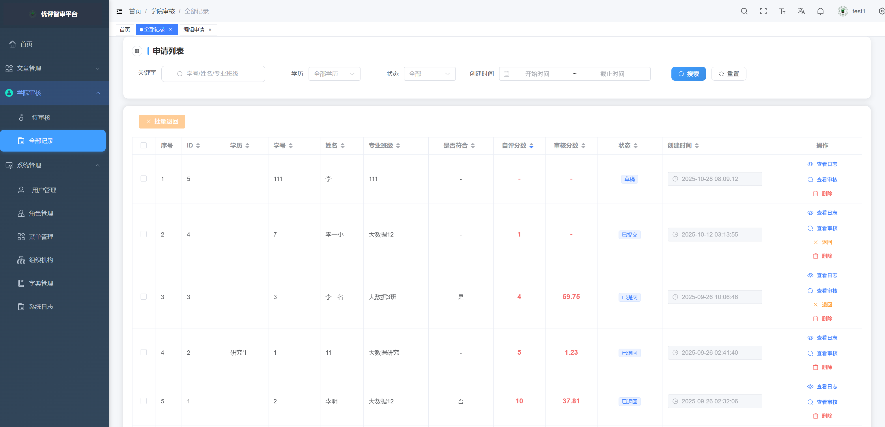
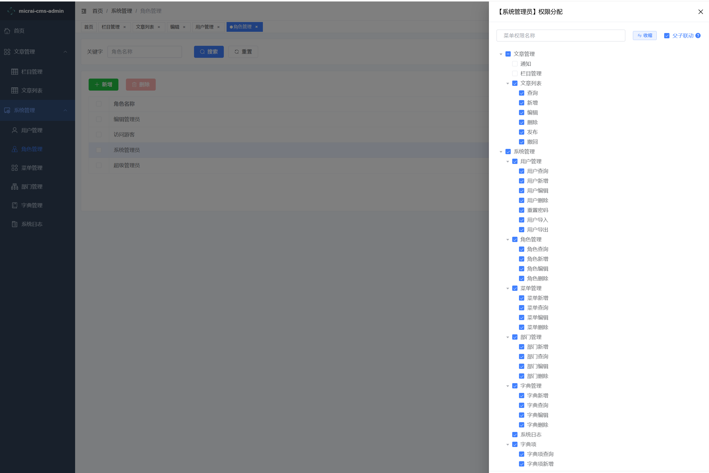
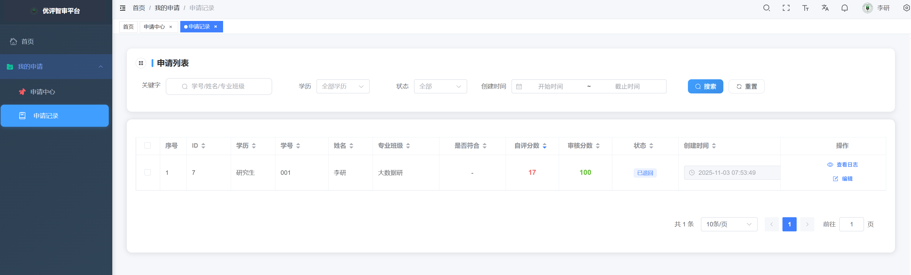
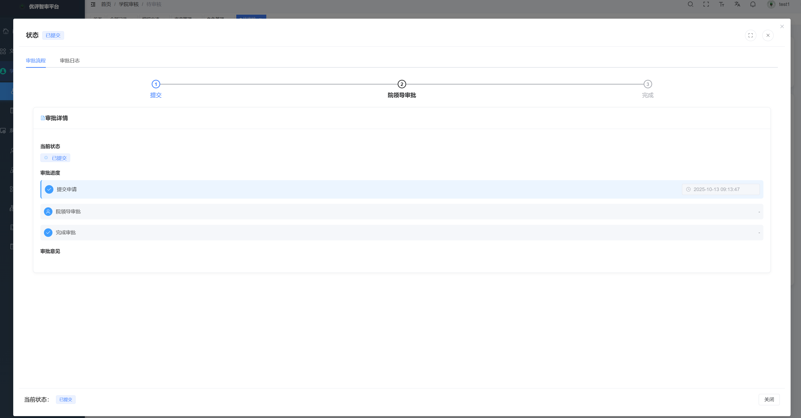

<div align="center">
  
  <h1>micrai-cms-admin</h1>


</div>


## 项目简介

[micrai-cms-admin](https://gitee.com/hebwkznkjyxgs_admin/micrai-cms-admin.git) 基于 Vue3、Vite7、TypeScript 和 Element-Plus 搭建的极简AI后台管理前端模板，可用于网站后台、智能体后台、协同办公前端。 配套 Java 后端   和 python  智能体后端  。

## 项目特色

- **AI功能：**   同时与多个大模型对话中下指令，创作生成文本内容、视频，并分发到头条、抖音、小红书等。
- **数据交互**： [线上接口文档](http://micrai.com:8045/swagger-ui/index.html)，并提供配套的 [Java]  和 [python]  后端源码。
- **简洁易用**： Vue3版本的后台管理系统，可用于网站后台，协同办公、智能体后台。
- **系统功能：** 提供用户管理、角色管理、菜单管理、部门管理、字典管理、系统配置、文章管理 、栏目管理、日志管理等功能模块。
- **权限管理：** 支持动态路由、按钮权限、角色权限和数据权限等多种权限管理方式。
- **基础设施：** 提供国际化、多布局、暗黑模式、全屏、水印、接口文档等功能。
- **持续更新**：项目持续开源更新，实时更新工具和依赖。


## 项目截图

🖥️ **控制台**

  
  
  
  


## 项目启动

- **环境准备**

| 环境类型       | 名称                     |     备注          |
|----------------|---------------|----------- |
| **开发工具**   | [Visual Studio Code](https://code.visualstudio.com/Download) |
| **运行环境**   | ^20.19.0 || >=22.12.0  |    20.19.0+ 或 22.12.0 及以上版本   |


- **快速开始**

```bash
# 克隆代码
git clone https://gitee.com/hebwkznkjyxgs_admin/micrai-cms-admin.git

# 切换目录
cd vue3-element-admin

# 安装 pnpm
npm install pnpm -g

# 设置镜像源(可忽略)
pnpm config set registry https://registry.npmmirror.com

# 安装依赖
pnpm install

# 启动运行
pnpm run dev
```


## 项目部署

执行 `pnpm run build` 命令后，项目将被打包并生成 `dist` 目录。接下来，将 `dist` 目录下的文件上传到服务器 `/usr/share/nginx/html` 目录下，并配置 Nginx 进行反向代理。

```bash
pnpm run build
```

以下是 Nginx 的配置示例：

```nginx
server {
    listen      80;
    server_name localhost;

    location / {
        root   /usr/share/nginx/html;
        index  index.html index.htm;
    }

    # 反向代理配置
    location /prod-api/ {
        # 请将  端口 8045 替换为您的后端 端口 地址，并注意保留后面的斜杠 /
        proxy_pass http://localhost:8045/;
    }
}
```


## 后端接口

> Java后台，按照以下步骤将在线接口转为本地后端接口，创建企业级前后端分离开发环境，助您走向全栈之路。

1. 获取基于 `Java` 和 `SpringBoot` 开发的后端  源码。
2. 根据后端工程的说明文档 [README.md]  完成本地启动。
3. 修改 `.env.development` 文件中的 `VITE_APP_API_URL` 的值，将其从 http://micrai.com:8045 更改为 http://localhost:8989 即可。


Thanks to all the contributors!
感谢所有的贡献者！


## 特别感谢

- 感谢 [GitCode](https://gitcode.com/) 官方的 [G-Star](https://gitcode.com/g-star) 认证

## 演示网址

-  [演示网址](http://demo.micrai.com/) http://demo.micrai.com/   管理员帐号：test1  密码：111111


## 加群交流
[] 

② 直接添加微信 **`cwebcrm`** 备注「前端/后端/全栈」。


