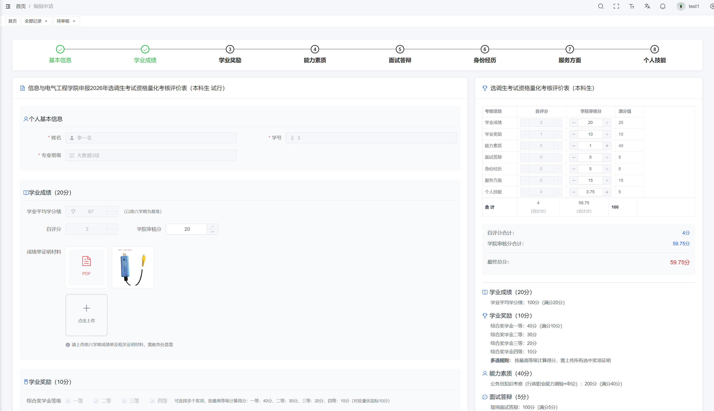
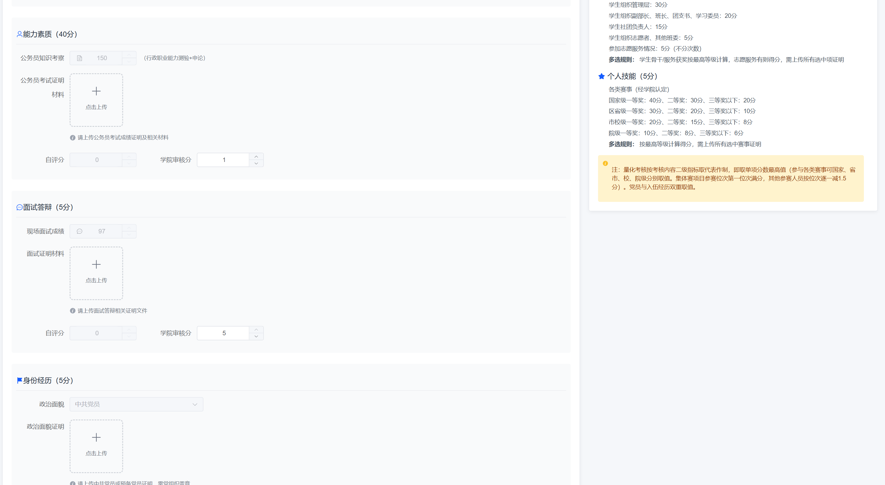
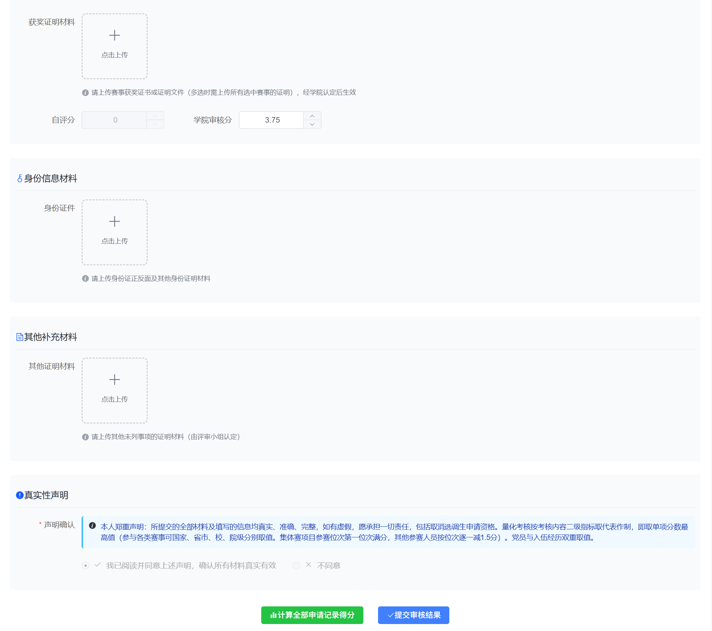
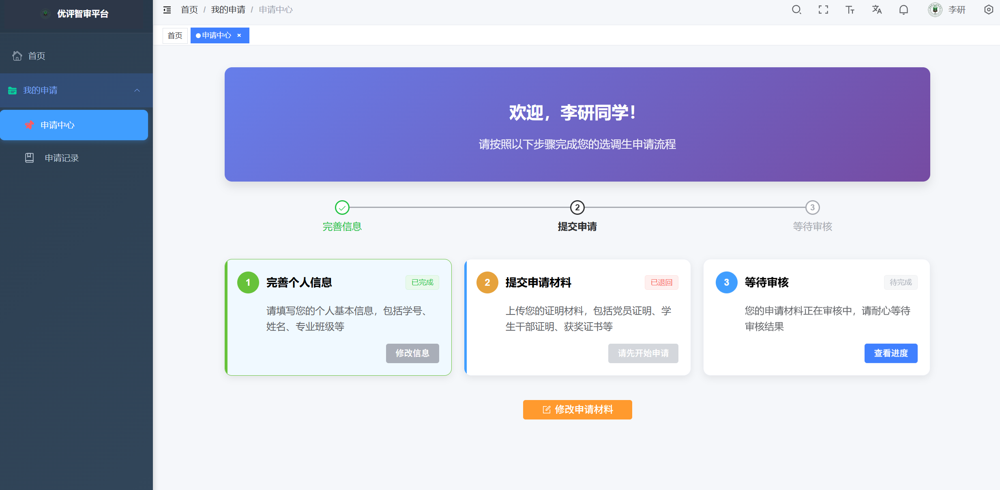

<div align="center">
  
  <h1>优评智审平台</h1>

</div>


## 项目简介

# 优评智审- 智能评优量化审核系统

> 版本：1.0
> 更新日期：2025年11月
> 适用对象：学院审核教师、系统管理员

---

## 一、平台简介

**优评智审平台** 是一套基于 AI 辅助的选调生考试资格量化考核审核系统，支持：

- 学生在线提交申请材料
- 系统自动计算初审分数
- 教师人工复核与调整
- 多级权限控制（学院管理员、校级管理员等）
- 审核日志追溯与数据统计

平台地址：[http://demo.micrai.com/](http://demo.micrai.com/)

---

## 二、登录与账号管理

### 2.1 登录方式
- 使用 **手机号 + 密码** 登录
- 支持 PC 浏览器（推荐 Chrome / Edge）或 **微信内置浏览器**
- 测试账号：`test1` / `111111`

### 2.2 新增学院管理员
1. 登录后进入【系统管理】→【用户管理】
2. 点击【新增】
3. 填写：
   - **手机号**（必填，作为登录账号）
   - **用户名**（真实姓名）
   - **昵称**（可选）
   - **角色**：选择 “学院管理员”
4. 默认密码为 `1`，建议首次登录后修改（点击右上角用户名 → 个人中心 → 修改密码）

---

## 三、角色与权限配置

1. 进入【系统管理】→【角色管理】
2. 选择目标角色（如“学院管理员”）
3. 点击【权限分配】
4. 勾选所需菜单权限（如：学院审核、字典管理、用户管理等）
5. 点击【保存】

> ⚠️ 权限变更实时生效，请谨慎操作。

---

## 四、考核指标（字典）管理

### 4.1 查看/修改指标分值
1. 进入【系统管理】→【字典管理】
2. 找到对应三级指标（如“科研成果-论文-核心期刊”）
3. 点击【编辑】，修改分值
4. 点击【确定】保存

### 4.2 新增考核项
- 支持在树形结构中新增指标
- **重要规则**：二级指标与其子项必须属于同一“字典类别”

---

## 五、学院审核流程

### 5.1 进入待审核列表
- 菜单路径：【学院审核】→【待审核】
- 可按“本科生”或“研究生”筛选

### 5.2 审核步骤
1. **查看申请**：点击【查看审核】，查看学生上传的证明材料（图片/PDF）
2. **自动评分**：点击【计算全部申请记录得分】，系统自动打分
3. **人工调整**：如需修正，直接修改“审核分数”字段
4. **填写意见**：
   - 在“符合申报条件”下拉框选择 **是 / 否**
   - 输入详细审核意见（如：“竞赛获奖未提供盖章证明”）
5. **提交结果**：点击【完成审核】
6. **特殊情况处理**：
   - **退回**：材料不全时点击【退回】，学生可重新提交
   - **删除**：仅用于无效或测试数据

---

## 六、数据查询与统计

- 路径：【学院审核】→【全部记录】
- 支持按学历筛选、多字段排序
- 点击【查看日志】可追溯完整审核历史（谁在何时做了什么操作）

---

## 七、注意事项

### 7.1 审核规范
- 分数必须客观、有据可依
- 审核意见应具体明确，避免“材料不全”等模糊表述

### 7.2 数据安全
- 勿泄露账号密码
- 审核完毕及时退出系统
- 建议定期修改密码

### 7.3 技术建议
- 推荐使用 **Chrome / Edge / 微信浏览器**
- 如遇系统异常，请联系技术支持

---

## 八、技术支持

- 平台由 **Micrai 智能体团队** 开发维护
- 问题反馈请添加微信：`cwebcrm`（备注“优评智审-学院名称”）
- 或联系系统管理员

---

> © 2025 优评智审平台 | 基于 [micrai-cms-admin](hhttps://github.com/wangqingzhou/xds) 构建
> 特别感谢 [GitCode G-Star 计划](https://gitcode.com/g-star) 认证支持


## 项目截图

🖥️ **控制台**

  
  
  
  
  
  
  
  


## 项目启动

- **环境准备**

| 环境类型       | 名称                     |     备注          |
|----------------|---------------|----------- |
| **开发工具**   | [Visual Studio Code](https://code.visualstudio.com/Download) |
| **运行环境**   | ^20.19.0 || >=22.12.0  |    20.19.0+ 或 22.12.0 及以上版本   |


- **快速开始**

```bash
# 克隆代码
git clone hhttps://github.com/wangqingzhou/xds.git

# 切换目录
cd micrai-cms-admin

# 安装 pnpm
npm install pnpm -g

# 设置镜像源(可忽略)
pnpm config set registry https://registry.npmmirror.com

# 安装依赖
pnpm install

npm install pdfjs-dist --save

# 启动运行
pnpm run dev
```


## 项目部署

执行 `pnpm run build` 命令后，项目将被打包并生成 `dist` 目录。接下来，将 `dist` 目录下的文件上传到服务器 `/usr/share/nginx/html` 目录下，并配置 Nginx 进行反向代理。

```bash
pnpm run build
```

以下是 Nginx 的配置示例：

```nginx
server {
    listen      80;
    server_name localhost;

    location / {
        root   /usr/share/nginx/html;
        index  index.html index.htm;
    }

    # 反向代理配置
    location /prod-api/ {
        # 请将  端口 8045 替换为您的后端 端口 地址，并注意保留后面的斜杠 /
        proxy_pass http://localhost:8045/;
    }
}
```


## 后端接口

> Java后台，按照以下步骤将在线接口转为本地后端接口，创建企业级前后端分离开发环境，助您走向全栈之路。

线上接口文档：http://micrai.com:8045/swagger-ui/index.html
Java 后端：基于 Spring Boot，提供用户、权限、字典、审核等完整 RESTful API
示例 AI 请求体（用于智能体交互）

```Python 智能体后端：处理 AI 对话、内容生成与分发逻辑
{
  "chatMessages": [],
  "tools": [
    "read_first_chunk",
    "ask_user",
    "finish_with_summary",
    "plan"
  ],
  "modelName": "gpt-4.1",
  "schemaAwarenessData": {
    "extensionNames": [
      "bold", "italic", "heading", "bulletList", "aiAgent", "tiptapAiAgentBlockSelection"
    ],
    "customNodes": []
  }
}

```

Thanks to all the contributors!
感谢所有的贡献者！


## 特别感谢

- 感谢 [GitCode](https://gitcode.com/) 官方的 [G-Star](https://gitcode.com/g-star) 认证

## 演示网址

-  [演示网址](http://demo.micrai.com/) http://demo.micrai.com/   管理员帐号：test1  密码：111111


## 加群交流
[] 

② 直接添加微信 **`cwebcrm`** 备注「优评智审」。


